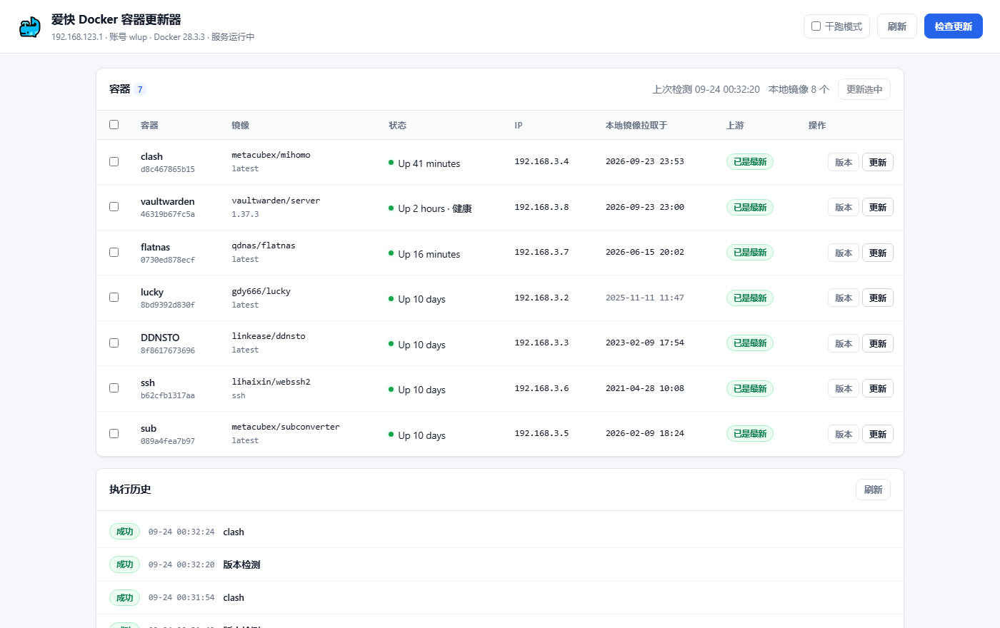
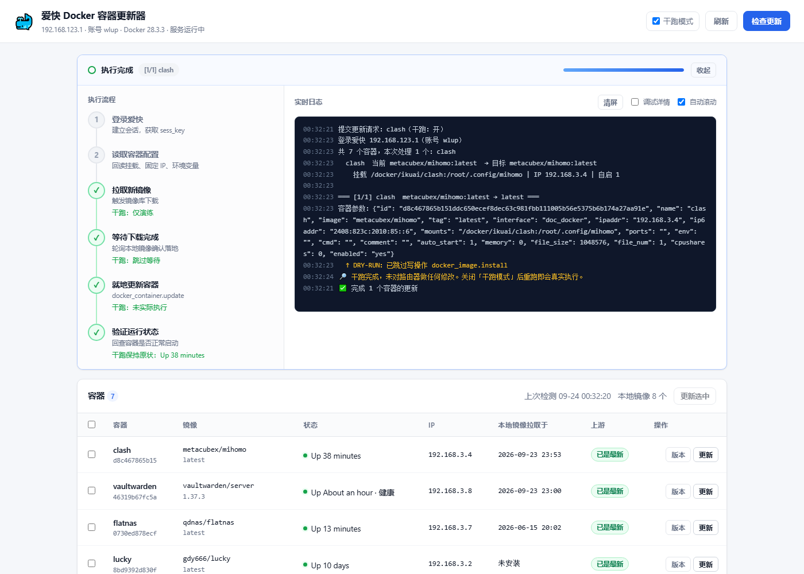
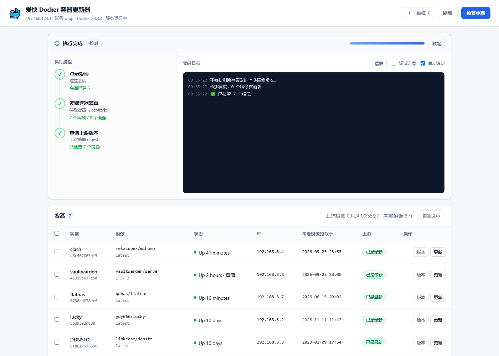

# 爱快 Docker 容器更新器 · Web 版

[](https://github.com/utterliar1/idocker/actions/workflows/ci.yml)
[](https://github.com/utterliar1/idocker/pkgs/container/idocker)

把 [爱快（iKuai）](https://www.ikuai8.com/) 路由器上的 Docker 容器更新，做成一个带**可视化执行流程**的网页应用，跑在**飞牛 NAS（fnOS）**的 Docker 里。

打开网页 → **概览条直接告诉你有没有要更新的、有几个** → 点「更新这 N 个」→ 确认后六步执行流程实时点亮 + 日志滚动 → 完成。

> 镜像地址：`ghcr.io/utterliar1/idocker`，容器名 `idocker`。改一行配置就能用，见下方**方式 A**。

## 界面预览

容器总览（含上游版本状态、本地镜像时间）：



六步执行流程（左侧流程图实时点亮，右侧实时日志）：



版本检测（三步流程，不碰路由器）：



> 以上截图取自**实际部署在飞牛（fnOS）上的容器**，不是本地开发环境。

---

## 它做了什么

| 能力 | 说明 |
|---|---|
| **概览条** | 容器表上方常驻一句结论：`⬆ 有 3 个容器可以更新` / `✓ 全部已是最新` / `尚未检测`，旁边就是「更新这 N 个」。可更新的容器**自动置顶 + 整行高亮**，不用自己翻表找 |
| 容器总览 | 名称、镜像、运行状态、固定 IP、本地镜像拉取时间 |
| 版本检测 | 直接查上游 manifest digest 比对，**只读，不改路由器任何状态**。加速源**取自爱快 Docker 服务设置**，与拉取侧同源，不会再出现「工具说有新版、爱快却拉不到」 |
| **打开就自动检测** | 上次结果超过 10 分钟就在后台静默重检一次，不用记得点「检查更新」；完成后轻提示报结论。`?autocheck=0` 可关 |
| 一键更新 | 走爱快 4.0 原生 `docker_container.update` **就地更新**，不删容器，挂载/固定 IP/环境变量全部保留。**更新前先弹确认框列出到底动谁** |
| **启动日志核查** | 更新完成后自动把容器启动日志写进执行记录；若容器**重建了却没有任何日志输出**，明确告警 —— 避免「状态 running，服务其实是死的」 |
| 可视化流程 | 六步流程图 + 实时日志终端 + 进度条，SSE 实时推送 |
| **自动刷新可控** | 列表每 60 秒自动刷新，顶栏按钮随时暂停/恢复（偏好记在浏览器，下次打开照旧）；数据没变化时不重绘，页面不会「跳一下」；跑任务时自动让路 |
| 干跑模式 | 全程只演练不发写请求，确认无误再放开 |
| 版本锁定 | 可选任意 tag 更新（自动列出该镜像的全部可用版本） |
| **定时任务** | 按「每 N 分钟」或「每天 HH:MM」自动检测指定容器，**有新版本才更新**，没变化绝不动容器 |
| **可调超时** | 下载等待时长在页面上随时可改（60 ~ 7200 秒），落盘持久化 |
| **手机 / 深色** | 窄屏把表格转成卡片式，不再需要横向拖动；深色主题跟随系统 |
| 执行历史 | 最近 60 次执行记录，**每条都能点开看完整日志**（含失败原因、每步耗时），支持一键复制 |

**为什么不用 Watchtower 那类方案**：Watchtower 需要挂载 `docker.sock`、要提权、还会脱离爱快的编排层（爱快 UI 用自己的库登记容器，外部重建后列表和配置会乱）。本方案走爱快自己的 HTTP API，**不依赖任何漏洞、不需要 SSH、不脱离爱快编排层**。

---

## 前置条件

1. 爱快固件为 **4.0**（3.x 的 `func_name` 划分不同，本工具不兼容）
2. 飞牛 NAS 与爱快路由器**网络可达**（同一局域网即可）
3. 飞牛已装好 Docker（fnOS 自带 Docker 应用）
4. 一个爱快登录账号（就是登录路由器后台那个）

---

## 部署

### 方式 A（最快）：直接用 ghcr.io 现成镜像

镜像由 GitHub Actions 构建 —— 每次改动**先跑完整回归测试，全绿才打包**，
打完还会把镜像真拉起来起容器冒烟验证一遍。所以直接用就行，不用自己 build。

```bash
mkdir -p /vol1/1000/docker/idocker && cd /vol1/1000/docker/idocker

cat > docker-compose.yml <<'YAML'
services:
  idocker:
    image: ghcr.io/utterliar1/idocker:latest
    container_name: idocker
    restart: unless-stopped
    ports:
      - "3001:8088"                 # 左边对外端口，8088 常被 filebrowser 占，冲突就改
    environment:
      IKUAI_URL: "192.168.123.1"    # 你的爱快地址
      IKUAI_USER: "admin"
      IKUAI_PASS: "你的爱快密码"
      AUTH_USER: "admin"            # 网页登录账号；留空 = 不认证（仅限内网）
      AUTH_PASS: "你的网页访问密码"   # 登录页登录；密码管理器可保存并自动填充
      PULL_TIMEOUT: "1800"          # 大镜像等久一点
      TZ: "Asia/Shanghai"
    volumes:
      - ikuai-updater-data:/data

volumes:
  ikuai-updater-data:
YAML

docker compose up -d
docker compose logs -f              # 看到启动横幅即成功，Ctrl+C 退出
```

可用标签：

| 标签 | 什么时候产出 |
|---|---|
| `latest` | main 分支每次推送 |
| `sha-xxxxxxx` | 每次构建，钉住具体 commit |
| `1.4.1`、`1.4` | 推 `v1.4.1` 这样的 tag 时 |

> 拉不动 ghcr.io 的话，给镜像名加个加速前缀即可，例如
> `docker.1ms.run/ghcr.io/utterliar1/idocker:latest`。

### 方式 B：从源码本地构建

下面「第一步 ~ 第四步」是这条路线。

### 第一步：把代码传到飞牛

把整个 `webapp/` 目录传到飞牛的任意存储空间，例如 `/vol1/1000/docker/idocker/`。
用 SMB 共享 / 文件管理器上传，或 SSH 用 `scp`。

传完后目录里应该有：`Dockerfile`、`docker-compose.yml`、`app/`（内含 `server.py`、`ikuai_api.py`、`jobs.py`、`static/`）。

### 第二步（推荐）：建配置文件

```bash
cd /vol1/1000/docker/idocker
cp .env.example .env
vi .env        # 填爱快地址、账号密码、网页访问密码
```

`.env` 内容：

```ini
IKUAI_URL=192.168.123.1          # 你的爱快后台地址
IKUAI_USER=admin                 # 爱快登录账号
IKUAI_PASS=你的爱快密码

AUTH_USER=admin                  # 网页登录账号
AUTH_PASS=你自己设的访问密码       # 留空 = 不认证，只建议纯内网用；登录后 7 天内免重复登录

WEB_PORT=8088                    # 对外端口（注意：飞牛上 8088 常被 filebrowser 占用，冲突就改）
PULL_TIMEOUT=240                 # 等镜像下载的最长秒数，镜像大就调大
DRY_RUN=0                        # 1 = 全程干跑
REGISTRIES=https://docker.1ms.run,https://hub.rat.dev,https://docker.m.daocloud.io

BASE_IMAGE=python:3.13-alpine    # 构建用基础镜像；拉不到 docker.io 时换成加速源，见下方
```

> 不想用 `.env` 也行，`docker-compose.yml` 里每项都写了默认值，直接改那个文件同样有效。
>
> **端口冲突要先查**：飞牛上 `filebrowser` 默认就占 `8088`。部署前跑一下
> `ss -ltn | grep :8088`，被占用就在 `.env` 里把 `WEB_PORT` 改成别的（如 `3001`）。

### 第三步：启动

> **⚠️ 90% 的人会卡在这里**：飞牛的 Docker 默认镜像源（`docker.fnnas.com`）会返回 **401 Unauthorized**，表现为构建时卡在
> `failed to resolve source metadata for docker.io/library/python:3.13-alpine`。
> **先看下方「构建时拉不到 python:3.13-alpine」一条把 `BASE_IMAGE` 填好，再执行下面的命令。**

**方式 A — SSH 命令行（最稳）**

```bash
cd /vol1/1000/docker/idocker
docker compose up -d --build
docker compose logs -f          # 看到启动横幅即成功，Ctrl+C 退出
```

**方式 B — 飞牛 Docker 应用界面**

「Docker → Compose → 新增项目」，项目目录选到 `webapp/`，把 `docker-compose.yml` 内容贴进去，启动即可。
若界面不支持 `build:`，用下面的方式 C。

**方式 C — 不构建，直接用官方 Python 镜像**

改 `docker-compose.yml`，把 `build: .` 那行删掉，把 `image:` 换成 `python:3.13-alpine`，并给容器加一行命令和目录映射：

```yaml
    image: python:3.13-alpine
    command: ["python", "/app/server.py"]
    volumes:
      - ./app:/app:ro            # 直接挂源代码，无需构建镜像
      - ikuai-updater-data:/data
```

这样完全跳过镜像构建，代价是每次改代码都要重启容器（无所谓）。

### 第四步：打开网页

浏览器访问 `http://飞牛IP:8088`，输入第二步设的访问账号密码。

顶部会显示 `192.168.123.1 · 账号 admin · Docker 28.3.3 · 服务运行中`，下面列出所有容器。

---

## 部署实况（已在真机验证）

本方案已在**真实飞牛 NAS + 真实爱快 4.0 路由器**上完整跑通，实测数据如下：

| 项目 | 实测结果 |
|---|---|
| 飞牛环境 | fnOS (内核 6.18) / Docker 28.5.2 / Compose v2.40.3 |
| 构建耗时 | **17 秒**（基础镜像已缓存时）；首次拉基础镜像约 6 分钟 |
| 镜像大小 | 小（纯标准库，无 pip 依赖，只有 `python:3.13-alpine` + `tzdata`） |
| 端口冲突 | 飞牛 `8088` 被 `filebrowser` 占用 → 改用 `3001` |
| 容器读取 | 7 个容器、8 个本地镜像，数据与爱快后台一致 |
| 版本检测 | 7 个镜像全部检测成功，上游状态正确显示 |
| 六步更新流程 | 干跑与真实更新均验证通过；已是最新时正确跳过重启 |
| 健康检查 | 容器 `healthy` |

### 实机验证暴露并修掉的 3 个真实 Bug

**① 运行中的容器被误显示成「本地未安装」**
爱快镜像的 `tag` 字段可能是**逗号分隔的多标签**（实测 `gdy666/lucky` 为 `"2.20.2,latest"`），
旧代码按 `repo:tag` 精确匹配会漏掉。同时该镜像的 `install` 字段为 `0`（无拉取记录），
旧代码直接当成「未安装」。现已支持多标签拆分 + 时间兜底，详见「常见问题 → 本地镜像时间」。

**② 更新一个已是最新的容器，会把容器白白重启一次**
旧逻辑靠识别爱快的「已存在相同内容」错误来判断镜像是否已最新。但实测发现爱快
**有时报错、有时只是安静地重新登记镜像并刷新 `install` 时间**——后者会让流程误判成
「有新镜像」，进而重启容器（实测 `sub` 容器被无谓重启，镜像 ID 其实完全没变）。
现已改为比对**拉取前后的镜像 ID（内容指纹）**，ID 不变就跳过更新与重启。

**③ 开启网页认证后，容器健康状态一直是 `unhealthy`**
原健康检查只认 HTTP 200，而 `/api/health` 在开启 `AUTH_PASS` 后会返回 **401**——
功能其实完全正常，但 Docker 一直标记为不健康。现已改为「能应答 HTTP 即算存活」
（200 与 401 都算健康），健康检查抽成独立的 `app/healthcheck.py`。

---

## 使用

打开页面会**自己检测一次上游版本**（10 分钟内的旧结果会直接复用），所以正常情况下什么都不用点 ——
容器表上方的**概览条**会直接给出结论：

1. **概览条**（容器表上方常驻）
   - `⬆ 有 3 个容器可以更新` + 一个 **「更新这 3 个」** 按钮
   - `✓ 全部 7 个容器都已是最新`
   - `尚未检测上游版本`（第一次打开，或离上次检测太久）
   - `有 1 个容器可以更新（另 2 个查询失败）`（加速源抽风时不掩盖问题）

   可更新的容器会**自动排到表格最前**，整行淡黄底 + 左侧竖条，不用一行行找；
   那几行的「更新」按钮也会变成主色。

2. **点「更新这 N 个」或某个容器的「更新」** —— 先弹**确认框**列出到底要动哪几个容器、
   说明会各重启一次、服务会短暂中断；确认后才弹执行面板，六个步骤逐步点亮：
   `登录爱快 → 读取容器配置 → 拉取新镜像 → 等待下载完成 → 就地更新容器 → 验证运行状态`。
   干跑模式下确认框会写明「不会真的重启容器」，按钮也变成「开始演练」。

3. **勾选多个 + 「更新选中」** —— 批量按顺序更新，进度条显示 `[2/3]` 这样的计数。
4. **「指定版本」按钮** —— 列出该镜像的全部可用 tag，选一个即可锁定版本更新（比如从 `latest` 换成 `1.37.3`）。
5. **「干跑模式」** —— 勾上后全程只演练、不发写请求，日志里会明确标注哪些步骤被跳过。**建议第一次先干跑一遍。**

### 打开就自动检测（不用记得点「检查更新」）

「有没有新版本」是每次打开页面最想知道的事，所以这一步交给页面自己：

- 打开后如果**上次检测结果已经超过 10 分钟**（或从来没检测过），就自己在后台跑一次；
- **静默执行** —— 不弹执行面板、不打断你正在看的内容，只在概览条上显示「正在检测上游版本…」，
  顶栏按钮临时变成「检测中…」；跑完用右下角轻提示告诉你结论（`有 2 个容器可以更新`）；
- 当时**已经有任务在跑**就自动让路，等跑完再说；失败也不会反复重试（同一阈值同时充当节流）；
- 页面一直开着时，会按同样的间隔周期性重检。

不想要这个行为：

```
http://飞牛IP:8088/?autocheck=0        完全关闭自动检测
http://飞牛IP:8088/?autocheck=1800     改成半小时才自动检一次（最小 60 秒）
```

### 智能跳过

如果镜像本来就和上游一致，工具会报 **「已是最新版本，未做任何改动」** 并**跳过容器重启** —— 不会因为「更新一个本来就不需要更新的容器」而白白中断服务。

判断方式有两重，任一命中即跳过：

1. 爱快直接返回「已存在相同内容」类错误；
2. **比对拉取前后的镜像 ID（内容指纹）**——ID 不变说明拿到的还是同一份内容。

第 2 条是必需的兜底：爱快对已存在的镜像**有时不报错，只是安静地重新登记并刷新拉取时间**，
只看错误信息会误判成「有新镜像」而多重启一次容器。

### 下载超时（镜像大怎么办）

镜像下载是**爱快后台自己做的**，本工具只负责轮询确认。等待上限默认 **900 秒（15 分钟）**，
可以在页面右上角 **「设置」** 里随时改（范围 60 ~ 7200 秒）。改完立刻生效，
并**落盘到容器卷 `/data/settings.json`**，重新构建镜像、重启容器都不会丢。

- 几百 MB 的镜像：600 秒够用；
- 上 GB 的镜像，或者加速源比较慢：建议 **1800 ~ 3600 秒**。

优先级：**页面上的设置 > 环境变量 `PULL_TIMEOUT` > 内置默认值**。

**超时不会破坏任何东西。** 只会跳过这个容器，**绝不拿旧镜像去重建它**，
其余容器照常处理（早期版本一旦超时会中止整批，现在改成单个容器失败不影响其他）。
日志里会明确提示「可在设置里把下载超时调大后重试」。

### 定时任务（自动检测 / 自动更新）

页面中间的 **「定时任务」** 面板可以给指定容器安排周期任务，两种模式：

| 模式 | 行为 |
|---|---|
| **仅检测版本** | 只刷新容器列表里的「上游」状态，**完全不动容器**（不选容器 = 检测全部） |
| **检测到新版就更新** | 先比对上游镜像指纹（digest），**只有真的变了才拉取并重启** |

频率支持两种写法：**每隔 N 分钟**（360 = 6 小时，1440 = 1 天）或 **每天 HH:MM**（如 03:30）。

「检测到新版就更新」的关键设计是**它不会到点就无脑拉取重启**。每次触发先查上游
`Docker-Content-Digest`，与上次记录的基准比对：

- **一致** → 整个容器直接跳过（拉取 / 下载 / 更新 / 验证四步都标 `skipped`），容器一动不动；
- **不一致、或还没有基准** → 才走完整的拉取 + 就地更新流程。

基准由「检查更新」和历次自动更新写入 `/data/state.json`。所以**建议先手动点一次
「检查更新」建立基准**，之后的定时任务就能精准识别真正的版本变化。

其它细节：

- 同一时刻只允许一个更新任务执行。定时任务撞上正在跑的任务时记一条「已跳过」，不排队堆积；
- 任务结果会回写到列表：**已完成 / 失败 / 已跳过** + 时间，悬浮可看详情；
- 每条任务都能「立即执行」一次（同样走「有变化才更新」的保守逻辑），用来先验证配置；
- **干跑模式开着时，定时任务也只会演练**，不会真的动容器。

### 便捷入口（可收藏为书签）

```
http://飞牛IP:8088/?autorun=check                  打开即自动开始版本检测
http://飞牛IP:8088/?autorun=update&container=clash&dry=1   预览更新流程（强制干跑，URL 无法触发真实更新）
http://飞牛IP:8088/?autorefresh=300              把自动刷新间隔改成 300 秒（默认 60，范围 5~3600）
http://飞牛IP:8088/?autocheck=0                  关掉「打开页面自动检测」（默认 600 秒一次）
```

---

### 登录（密码管理器能自动填充）

开了 `AUTH_USER` / `AUTH_PASS` 之后，打开网页先看到的是**登录页**，而不是浏览器弹出的
原生账号框。

这个区别很实际：原生框（HTTP Basic）密码管理器识别不了 —— 既不提示保存、也没法自动填充，
每次访问都得手打一遍。登录页是标准 `<form>`，账号框带 `autocomplete="username"`、
密码框带 `autocomplete="current-password"`，浏览器和 1Password / Bitwarden 这类工具
都能正常识别、保存、一键填充。

- 登录状态保持 **7 天**，用的是签名 cookie（`HttpOnly` + `SameSite=Lax`），容器重启也不掉线
- 改掉 `AUTH_PASS` 会让所有已发出的登录态**立即失效**（密钥由账号密码派生）
- 同一来源连续输错 5 次密码，临时锁定 60 秒
- 顶栏右侧的「退出」按钮可主动登出
- **`curl` / 脚本 / CI 仍可用 `Authorization: Basic` 头**，不受影响
- 浏览器弹原生框的开关是 `WWW-Authenticate` 响应头，本工具已经不再下发它

> 直连 IP、走 HTTP 的场景下，cookie 不带 `Secure` 标志（带了就不会发送）。
> 要更强保障，就在前面套一层 HTTPS 反向代理。

---

## 安全须知

- **务必设置 `AUTH_PASS`**。这个网页持有你路由器的登录凭据，虽然凭据不会下发到浏览器，但未认证的页面等于把路由器操作权限开放给整个局域网。
- **不要把端口映射到公网**。仅在内网使用。
- 容器内以非 root 用户运行，不挂载 `docker.sock`，不需要任何特权。凭据只用于向爱快发 HTTP 请求。
- 日志里的密码字段全部自动打码为 `******`。

---

## 常见问题

### 构建时拉不到 `python:3.13-alpine`

**症状**（飞牛上很常见）：

```
ERROR [internal] load metadata for docker.io/library/python:3.13-alpine
failed to resolve source metadata for docker.io/library/python:3.13-alpine:
unexpected status from HEAD request to https://docker.fnnas.com/v2/library/python/manifests/3.13-alpine?ns=docker.io: 401 Unauthorized
```

**原因**：飞牛 `daemon.json` 里预置的两个镜像源都是坏的 —— `registry.hub.docker.com` 不是有效的镜像端点，
`docker.fnnas.com` 返回 401。而 **Docker 遇到坏的镜像源不会自动回退到官方源**，直接报错退出。这跟 Dockerfile 无关。

**解决**：在 `.env` 里给基础镜像加个加速源前缀（`docker compose` 会自动作为 build arg 传进去）：

```ini
BASE_IMAGE=docker.1ms.run/library/python:3.13-alpine
```

然后重新 `docker compose up -d --build` 即可。**不需要改动系统任何配置，也不影响飞牛上其他容器。**

实测可用的加速源（2026-09 测）：

| 加速源 | 结果 |
|---|---|
| `docker.1ms.run` | ✅ 可用（推荐；速度偏慢，首次约 6 分钟） |
| `hub.rat.dev` | ✅ 可用 |
| `docker.m.daocloud.io` | ✅ 可用 |
| `docker.fnnas.com` | ❌ 401（飞牛默认） |
| `docker.xuanyuan.me` / `docker.nju.edu.cn` / `docker.1panel.live` | ❌ 403 |

> 想彻底修好（让飞牛上所有 `docker pull` 都正常），需要改 `/etc/docker/daemon.json` 的 `registry-mirrors`
> 并 `systemctl restart docker`。**这会重启 Docker 守护进程**（有 `live-restore` 时已有容器不受影响，但仍属系统级改动），
> 所以本方案默认不动它 —— 只在构建参数里绕过。

---

**页面能开，但提示「未配置 IKUAI_URL」**
环境变量没生效。检查 `.env` 是否和 `docker-compose.yml` 在同一目录、变量名是否全大写；改完要 `docker compose up -d` 重建容器（不是 restart）。

**容器列表读不到 / 报连不上**
多半是飞牛到爱快网络不通。在飞牛上执行 `curl -k https://192.168.123.1` 试一下。若飞牛和爱快不在同一网段，需要先在路由器上放行。

**版本检测全部「查询失败」**
检测用的是**爱快 Docker 服务设置里的加速源**（与爱快实际拉取同源）。先去爱快后台确认那几个源还可用；
定位问题看执行日志里「查询上游用的加速源」那行，失败记录会写明 `命中哪个源 → 什么原因`。
只有在读不到爱快配置、或爱快没配加速源时，才会回退到本工具内置源 —— 应急时可以临时改 `REGISTRIES`。

**更新后容器是 running，但服务打不开（主进程根本没起来）**

最隐蔽的一类故障：容器 `Up`、爱快后台看不出异常，实际**主进程从未启动**。
典型触发场景是**镜像换了 entrypoint**。

实测案例（lucky 2.20.2 → 2.27.2）：

| | 2.20.2 | 2.27.2 |
|---|---|---|
| Entrypoint | `/app/lucky` | `/app/start.sh` |
| 镜像自带 Cmd | `-c /goodluck/lucky.conf -runInDocker` | （空） |
| 配置目录 | `/goodluck` | `/app/conf` |

旧镜像自带的 Cmd 被回填到新容器后成了 `sh /app/start.sh -c /goodluck/lucky.conf -runInDocker`；
而 start.sh 用 `ps aux | grep "lucky.*-runInDocker"` 判断进程在不在，**匹配到了自己的命令行**，
于是永远认为「lucky 已在运行」→ 无限空转，从不真正启动 lucky。
症状特征：**容器 Up、内存只有几十 KB、端口不监听、日志停在入口脚本那两行**。

处理办法：**清空该容器的 `cmd`**，并把配置目录挂到新版要求的位置
（本仓库 `_test/fix_lucky.py` 是现成修法，默认只预演，加 `--apply` 才真正提交）。

> 跨大版本升级前，先确认新镜像的 **Entrypoint / 配置目录**有没有变，别把旧 Cmd 带到新镜像上。
> 现在工具会在更新后自动核查容器启动日志，这类「起来了但没干活」的情况会直接告警。

**镜像下载一直等不到**
镜像大或加速源慢，把 `PULL_TIMEOUT` 调大（如 `600`）。**下载未确认完成时工具会主动中止，不会用旧镜像重建容器**，所以不会把服务搞坏。

**容器更新后变成停止状态**
爱快后台看一下容器配置。工具会原样回填 `mounts`/`ipaddr`/`env`/`cmd`，理论上不会丢；真要回退，用「版本」按钮选回旧 tag 再更新一次即可，**数据在挂载目录里，不会丢**。

**时间显示不对**
容器时区问题。确认 `TZ=Asia/Shanghai` 且构建时 `tzdata` 装上了（构建日志里 `apk add tzdata` 那行）。

**「本地镜像时间」有的是灰的 / 显示成横线**
这是**如实反映爱快的数据**，不是 Bug。分三种情况：

- **正常黑色** —— 爱快记录的镜像**拉取时间**（`install` 字段）。
- **灰色** —— 该镜像爱快**没有拉取记录**（`install` 为 `0`，镜像是由导入或引用而来），
  此时显示的是镜像的**构建时间**（`created` 字段）。鼠标悬停有说明。例如 `gdy666/lucky`
  就是这种情况（它的 tag 还是个逗号多标签 `2.20.2,latest`）。
- **横线 `—`** —— 两个时间字段都不可用，属于异常，一般不会出现。

另外注意「上游」列的版本比对，比的是 **digest**，不是时间 —— 镜像构建时间新不代表内容不同。

---

## 自动化流水线

仓库根目录的 `.github/workflows/ci.yml` 干三件事，且是**串行卡关**的：

```
push / PR
   │
   ▼
① test    后端 110 项 + 前端 24 + 36 项回归（假爱快 + DOM 桩，零依赖，不装 pip 包）
   │       ✗ 挂 → 到此为止，不产出镜像
   ▼ ✓
② build   构建镜像并推到 ghcr.io/utterliar1/idocker
   │       PR 不推，只构建；main 推 latest + sha-xxxxxxx；打 v* tag 推语义版本
   ▼
③ smoke   把刚推上去的镜像真拉下来起容器：探活 /api/health、首页与静态资源、
          页面关键控件（概览条 / 一键更新 / 确认框 / 轻提示）与深色主题样式都在、
          容器自带 healthcheck.py、确认以非 root（appuser）运行，
          再单独起一个开了访问认证的容器验证登录页与会话 cookie 全链路
```

一句话：**测试没过就没有镜像，镜像产出了还得自己先跑得起来**。

触发方式：push 到 `main`、提 PR 到 `main`、推 `v*` tag、或手动 `workflow_dispatch`。

发新版本就是打个 tag：

```bash
git tag v1.4.1 && git push origin v1.4.1
# → ghcr.io/utterliar1/idocker:1.4.1 / :1.4 / :latest / :sha-xxxxxxx
```

推送 ghcr.io 用的是仓库自带的 `GITHUB_TOKEN`（workflow 里声明了 `packages: write`），
**不需要在仓库里配任何 secret**。

本地想复现同样的验证，跑这两条即可（CI 里就是它们）：

```bash
python _test/test_webapp.py
node _test/test_frontend.js
```

---

## 目录结构

```
webapp/
├── Dockerfile              基础镜像走 ARG BASE_IMAGE，可换成加速源；零 pip 安装
├── docker-compose.yml      飞牛部署用（BASE_IMAGE 由 .env 传成 build arg）
├── .env.example            配置模板
├── .dockerignore
├── README.md               本文件
├── screenshots/            实机界面截图
└── app/
    ├── server.py           HTTP 服务 + 路由 + SSE（纯标准库）
    ├── ikuai_api.py        爱快 4.0 API 客户端 + LocalImages 镜像索引
    ├── jobs.py             任务引擎：六步流程 + 事件流 + 历史持久化
    ├── scheduler.py        定时调度器（后台线程，15 秒一次 tick）
    ├── store.py            设置与定时任务的持久化（/data/settings.json）
    ├── healthcheck.py      健康检查（开认证后 401 也算存活）
    └── static/
        ├── index.html
        ├── style.css
        └── app.js
```

上一层目录（= 仓库根）还有：

| 文件 | 作用 |
|---|---|
| `.github/workflows/ci.yml` | **CI 流水线**：验证 → 推 ghcr.io → 冒烟测试，见上一节 |
| `.gitignore` | 排除 `.env`、运行时状态、`_mine/`（抓来的爱快前端 chunk） |
| `deploy_webapp.py` | 一键把 `webapp/` 同步到飞牛并重建容器 |
| `fnos_ssh.py` | 免交互 SSH 到飞牛执行命令（从 `.env` 读凭据、自动 sudo、支持 `--put/--get`） |
| `ikuai_docker_updater.py` | 等价的命令行版（`list` / `check` / `update` / `tags` / `server`） |
| `API_REFERENCE.md` | 爱快 4.0 Docker 接口完整参考（实测） |

`fnos_ssh.py` 远程部署排错时很顺手：

```bash
python fnos_ssh.py "docker compose ps"
python fnos_ssh.py --put webapp/Dockerfile /vol1/1000/docker/idocker/Dockerfile
```

数据卷 `/data` 存放：`settings.json`（下载超时 + 定时任务）、`state.json`（digest 基准）、`last_check.json`（上次检测结果）、`history.json`（执行历史）。都是可再生的元数据，删掉只会丢历史和定时任务配置。

同仓库上一层的 `_test/` 是本地回归测试，不参与镜像构建，改代码后可以先跑一遍再上机：

```bash
python _test/test_webapp.py          # 后端 110 项：假爱快 + 端到端断言
                                     #   （调度触发、超时跳过、幂等跳过、并发保护、加速源同源、历史日志等）
node _test/test_frontend.js          # 前端 24 项：自动刷新的时序行为
node _test/test_frontend_ux.js       # 前端 36 项：概览条 / 确认框 / 自动检测 / 轻提示
                                     #   （自动刷新开关/暂停、倒计时、静默刷新不重绘、后台顺延、任务期间让路）
```

前端那套跑起来约 30 秒——它用 `?autorefresh=5` 把间隔压到 5 秒，真实等待定时器触发，不是假装睡眠。

---

## 命令行版

如果只在电脑上临时用，同仓库上一层的 `ikuai_docker_updater.py` 是等价的命令行版本（`list` / `check` / `update` / `tags` / `server`），逻辑与本 Web 版一致。接口细节见 `../API_REFERENCE.md`。
